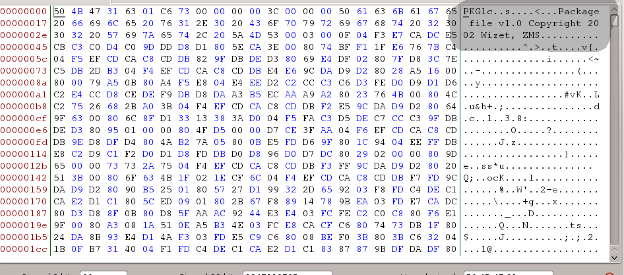

# Keith's MMORPG

Keith started to play a brand new MMORPG. One of their game files contains a flag to HSCTF 3. Find it.

[mystery_game_file](https://mega.nz/#!ztxWGDZI!YOVyShd9FwfWqNQNAeCnaeqU1vQJUuvPVbiGfwAqGE0)

## Solution

We are presented with a ~ 1gb file and the challenge text suggests its from a mmorpg game.

We open the file with our favorite hex editor, which for me is bless.

And we get some interesting info in the header.

* The header starts with PKG
* The copyright information suggest that whatever game this file belongs to was made by a company called Wizet.

We do a quick google search, and find that this game is called "Maple Story" and the company who made the game Wizet, got absorbed into their publishing company Nexon America.

After a good deal of search I found the program **HARepacker** , which was able to load the packed file and expose the file heirachy. The file contained thousands of image files and textual information, that make up the gameworld.

We had to find our flag, so we searched for "hsctf" and found a file in the heirachy under: **back => zero_Temple.img => hsctf_keyback => zero_Temple.img => hsctf_key**

This file contained our flag **the_mmorpg_gets_boring_after_a_while_because_the_game_sucks**

## Flag

**the_mmorpg_gets_boring_after_a_while_because_the_game_sucks**
