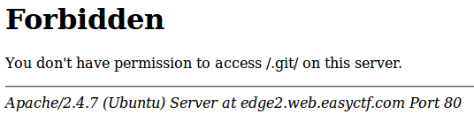
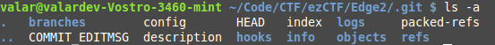

Edge 2
======
* **200 points**
* **Category: Web**
* **Problem statement:** _Last time we screwed up. But we've learned our lesson._
* **Hint:** _No hint_

Beginning with the same procedure as Edge 1, navigate to `/.git`



So the directory exists, but they've blocked directory listing!

So were going to do the same attack at last time, but instead of doing a recursive download, we will have to download the files manually.
There is going to be a lot of overlap between the Edge 1 and Edge 2 .git directories, since they are both cloned from the same project.
So lets start by copying everything from Edge 1 into an Edge 2 directory.



So we need to replace all the `logs, refs, COMMIT_EDITMSG, HEAD, index, and then finally the objects`.

Updating everything but objects is pretty straightforward.

Just navigate to the `/logs/HEAD` and `logs/refs/heads/master` to ge those files, and likewise for the rest of the files.

Now we can take the git log!

``` html
$ git log
commit a48ee6d6ca840b9130fbaa73bbf55e9e730e4cfd
Author: Michael <michael@easyctf.com>
Date:   Mon Mar 13 07:32:12 2017 +0000

    Prevent directory listing.

commit 6b4131bb3b84e9446218359414d636bda782d097
Author: Michael <michael@easyctf.com>
Date:   Mon Mar 13 07:32:10 2017 +0000

    Whoops! Remove flag.

commit 26e35470d38c4d6815bc4426a862d5399f04865c
Author: Michael <michael@easyctf.com>
Date:   Mon Mar 13 07:32:09 2017 +0000

    Initial.

commit 15ca375e54f056a576905b41a417b413c57df6eb
Author: Fernando <fermayo@gmail.com>
Date:   Sat Dec 14 12:50:09 2013 -0300

    initial version

```

Now we have to update the objects directory. Here is the format of the directory:

```
$ ls objects
09  15  3e  61  6a  7b  8a  96  9e  a7  b9  bf  e0  ee    pack
14  37  5d  64  71  7c  94  9b  a1  af  bd  d1  ed  info
$ ls objects/15
ca375e54f056a576905b41a417b413c57df6eb
$ cat objects/15/ca375e54f056a576905b41a417b413c57df6eb
x�jC!��)�@ˮ������cյ��)��yW��

                                 L�ե��Et��|4NE��H7����E{�Uw�җ�8Q	>�d���>W\A���[t\�Q�\�c�o��{�Rd6������J�]5�-��v�	@���[�n�j�����d>���3�D�
```
Each folder in objects is the first 2 characters of the SHA1, and the names of the files are the rest of the SHA1.
The contents of each file is not ascii.
Git objects are actually zlib compressed to save space, so
``` html
$ zlib-flate -uncompress < objects/15/ca375e54f056a576905b41a417b413c57df6eb commit 220tree 7b456b0125e74b44d1147182019c704c53132013
parent 8ac4f76df2ce8db696d75f5f146f4047a315af22
author Fernando <fermayo@gmail.com> 1387036209 -0300
committer Fernando <fermayo@gmail.com> 1387036209 -0300

initial version

```
So each commit has a git object with files it edited!
So we are going to need to checkout the commit:
``` html
commit 26e35470d38c4d6815bc4426a862d5399f04865c
Author: Michael <michael@easyctf.com>
Date:   Mon Mar 13 07:32:09 2017 +0000

    Initial.
```
So

``` html
$ zlib-flate -uncompress < objects/26/e35470d38c4d6815bc4426a862d5399f04865c
commit 215tree 323240a3983045cdc0dec2e88c1358e7998f2e39
parent 15ca375e54f056a576905b41a417b413c57df6eb
author Michael <michael@easyctf.com> 1489390329 +0000
committer Michael <michael@easyctf.com> 1489390329 +0000

Initial.

```
Then get the file `objects/32/3240a3983045cdc0dec2e88c1358e7998f2e39`
I did the same for every other commit.

Then `git checkout 26e35470d38c4d6815bc4426a862d5399f04865c`
and then theres a flag.txt in the main dir!
```
$ cat flag.txt
easyctf{hiding_the_problem_doesn't_mean_it's_gone!}

```
