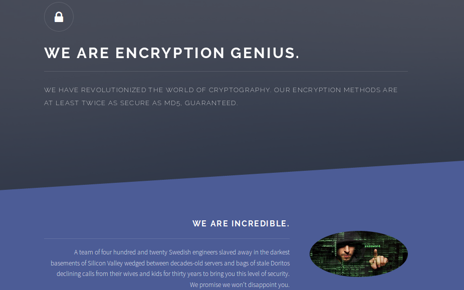
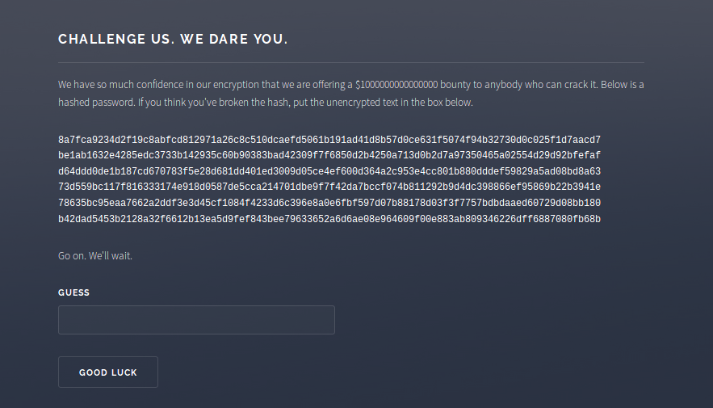
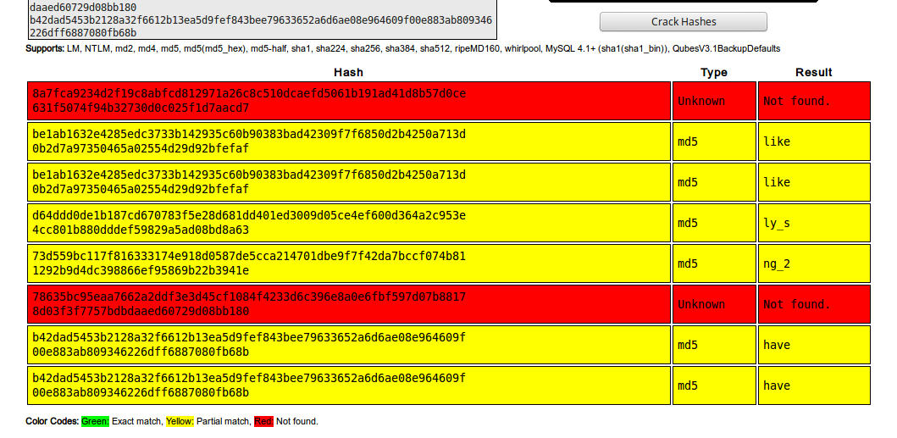

Genius
======
* **230 points**
* **Category: Cryptography**
* **Problem statement:** _Your boss told you that this [team](http://genius.web.easyctf.com/) has come up with the cryptographic hash of the future, but something about their operation just seems a little fishy._
* **Hint:** _No hint_

Here's the site:



So this tells us what we have to do, crack that hash, and make `$1000000000000000`!

Since they hinted at their hash being twice the strength of md5, I thought I'd just put it into [crackstation's](https://crackstation.net/) hash cracker, and see whats going on.



This shows us that there are 4 byte words in these hashes!
Lets take the MD5 hash of `like`, and see how it compares to these strings.

`md5(like) = be1ab1632e4285edc3733b142935c60b`
The hash it was found in is
`be1ab1632e4285edc3733b142935c60b90383bad42309f7f6850d2b4250a713d0b2d7a97350465a02554d29d92bfefaf`

So the md5 of `like` is the first 32 chars of the line it was in! This hash is looking like it is the concatenations of 3 md5's of 4 byte strings!

So I split the given hash into 32 char chunks, and than began brute forcing 4 byte strings with lowercase and UPPERCASE letters, `{_}`, and numbers.
This gives us:

```
$ python3 geniusSolver.py
4cc801b880dddef59829a5ad08bd8a63   0_lo
d401ed3009d05ce4ef600d364a2c953e   0oO0
1292b9d4dc398866ef95869b22b3941e   3_md
78635bc95eaa7662a2ddf3e3d45cf108   5_we
8a7fca9234d2f19c8abfcd812971a26c   OMG_
90383bad42309f7f6850d2b4250a713d   _LIT
5cca214701dbe9f7f42da7bccf074b81   _MAK
ef843bee79633652a6d6ae08e964609f   _no_
0b2d7a97350465a02554d29d92bfefaf   eral
b42dad5453b2128a32f6612b13ea5d9f   have
00e883ab809346226dff6887080fb68b   id34
8c510dcaefd5061b191ad41d8b57d0ce   it_t
be1ab1632e4285edc3733b142935c60b   like
d64ddd0de1b187cd670783f5e28d681d   ly_s
73d559bc117f816333174e918d0587de   ng_2
631f5074f94b32730d0c025f1d7aacd7   ook_
4f4233d6c396e8a0e6fbf597d07b8817   rrk_
8d03f3f7757bdbdaaed60729d08bb180   you_
OMG_it_took_like_LITerally_s0oO00_long_2_MAK3_md5_werrk_you_have_no_id34
```

Putting that into the website's prompt gives a popup with the flag:
`easyctf{OUR_3nCRYpti0n_is_N0T_br0k3n_Ur_brok3n_6c5a390d}`

Looks like no `$1000000000000000` for us :(. Pretty easy challenge however!
