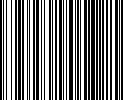
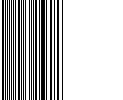

# Gibberish

You are given an image, gibberish.png and from this and the different hints,
you have to find the flag!

## Solution

The solutions for this challenge lies in carefully following the hints in the 
description.

The first thing to note, is that there are 3 colors of the rainbow, in this case
we assume RED,GREEN and BLUE as in the RGB color mode.

The second thing is that the only thing that matters is color, not intensity!!

The third thing is that one of the parts is represented by a barcode.

My idea is to take each pixel on the gibberish.png image and check if it contain
a R value and then on a blank image (with white background), draw the corresponding
pixel as black.

After the first image has been drawn this way, I will move on with the G and B values
respectively.

We were told that one of the images should be treated as a barcode and we can see upon
visial inspection that the likely candidate is *newfile-g.png*

We use an app on our smartphone, and scan the image, giving us a strange looking string
*LH5i6uQz*

Now we will have to see what we can do with the other 2 images. They look kinda of like
barcodes but arent wide enough, if we zoom in using our favorite image editor, we can
see that if we take the first line of pixels, we can divide them into groups of 8 pixels.

By doing this we can immediately see that each group of 8 pixels fall inside 7 bit ascii
values, if we assume that a black pixel represent a binary 1. This holds true for both
*newfile-r.png* and *newfile-b.png*.

To test our thesis, we produce a perl script, in order to print the resulting ascii strings.

The 2 resulting strings are:

* aPgMasSt
* 5U5EYz2b

Having scanned in *LH5i6uQz*, we do a quick comparison and can see that the strings are of
equal length. Its some re-assurance that our idea was right, but now we have to figure
out what those strings represent.

First we try to base64 decode them, but we are left with nothing but gibberish (lol),
secondly we try to apply a columnar transposition cipher, which also doesn't yield anything
promising. In desperation we also try to form anagrams of each string, this is also to
no avail.

After a lot of fiddeling about, we read the challenge text once again and ponder the
statement "my flag never expires". 

What never expires? First idea was salt, that could work if it was some crypto stuff,
but then it would have to be hashes of some kind. No known hashes with 8 characters,
atleast i could find.

In the course of the CTF we had shared a lot of code pieces and hints amongst team
members and we always used pastebin for this. Thinking about the piece of information
that the flags never expire. It dawned on me that pastebins can be set to expire,
or not to expire at all!!

On to pastebin and make a random entry and bamm!! The hash in the end of the url 
was indeed 8 characters, just like the strings we found!!

We visit each pagebin post conforming to the strings we found and get the following
urls

* http://pastebin.com/LH5i6uQz
* http://pastebin.com/aPgMasSt
* http://pastebin.com/5U5EYz2b

Piecing the content of the pastebins together, we get the following string:

*easyctf{col0rs_b4rcod3s_and_b1nary_f?n}*

Brilliant, but there are just the ? to take care of, what should we put instead?
My first guess was u, and with that, the flag was put into the form and send away.

*easyctf{col0rs_b4rcod3s_and_b1nary_fun}*

That being said, first time i tried with u, it didnt work for some reason and i tried
with all the letters A-Z,a-z,0-9 with the same result ofcourse, untill i way later
tried with u again, and it worked.

## Appendix

The perl program for decoding the gibberish.png image, is added in this directory
as well as the images produced.
