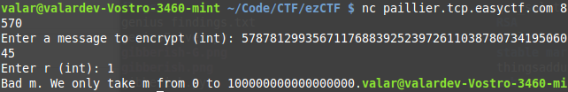

Paillier Service
======
* **400 points**
* **Category: Cryptography**
* **Problem statement:** _My friend made some sort of encryption service using the Paillier cryptosystem. Can you get him to encrypt the string_ `easyctf{3ncrypt_m3!}` _for me? Your flag will be a base 10 integer. Access his encryption service at paillier.tcp.easyctf.com 8570._
* **Problem hint:** [https://en.wikipedia.org/wiki/Paillier_cryptosystem]

This was a really easy/straightforward Paillier Cryptosystem Problem! It was a great way to learn about the Paillier Cryptosystem!

We are not actually 'cracking' the Paillier Cryptosystem for this challenge, we are gaining the ability to encrypt our own messages already given the ability to choose the message and random number.
(n,g) is the normal public key for this cryptosystem

We are given a service that will take a message and a random number, and encrypt it.
So if we convert `easyctf{3ncrypt\_m3!}` to an integer, we get: `goal = 578781299356711768839252397261103878073419506045`

Just trying that in the service gives us:


Nope, that would be too easy! So lets dive into the Paillier cryptosystem.

A bit of info about the Paillier Cryptosystem: Its a Homomorphic probabilistic public key cryptography system. What that means:

* **Homomorphism:** decryption(encryptedMessage1*encryptedMessage2) = plaintext1 + plaintext2 (recall that plaintexts are just numbers, that are decoded in different ways)
* **Probabilistic:** A message can be encrypted in many different ways using the same key, so a lookup table is impossible, but all of these decrypt to the same message.

Because of these properties, Paillier was considered for use in voting! Since your encryption could be posted online, so you could verify your vote was included but noone would be able to decrypt it, and since anyone can verify final tallies themselves by using homomorphic property. (They were suggesting some clever math trick with the homomorphic property)

We only care about encryption here.
There are 2 parameters, g and n that are fixed. g is some number less than n^2
To encrypt a message m, you do
```
c = (g^m)(r^n) mod n^2
```
where r is a random number less than n

Getting g is easy! Make `m = 1, r = 1`, and then c is g!
Now that we have g, increase m by 1 and put that into the service.
Lets call that c, `g2`.
```
g2 = (g^2)(r^1) mod n^2
```
From the definition of modulo:
```
g^2 - g2 = k*n^2
```
If we do that for a couple of message values, `g3,g4,g5...`, we should get enough values of things that n factors into to find n. We can also test any n that we have by just raising r by 1, and seeing if we get the expected results. Additionally we know that n must be a perfect square.

I was about to begin coding something to check and do all that, but I decided to to put `g^2 - g2` into factordb, to see if it was something easy.

It turns out it couldn't have been easier! [n^2](http://factordb.com/index.php?query=5798538653888539901597848427517969653836466115517969383372708870414714499617827919081008045594866982763105646644372338947397604803459773840293469909226652409932292738680899406600644983627115148887597252501633030431493839737373550416008171962862019762627103772150765139863891942898620438599013950682968605378779376177177674907711300613428274776825775262927905232074930124107146351812226270525769638205645994715845402250228930059068632810802972672468136930221393868938524467573682405407138393007431711067835620882211146022714703452437637457743332651319267650941254285905416029921843019550300652534365188846201833030209) is the square of a [prime](http://factordb.com/index.php?id=1100000000882961502)!

So now we have everything we need to encrypt! Set r to 1 for convenience, and then its just a single modpow. I just used the Homomorphic property in my code, since I think its cool, but you can compute it directly.
``` python
m5r1 = pow(g,5,n2)
goalDiv5 = goal // 5
# Now use the Homomorphic property :)
flagInt = pow(m5r1,goalDiv5,n2)
print(flagInt)
```
The flag's an integer not some string that you can hex decode, since theres of tons equally valid ways to encode this message.
（Imagine all the different factorizations of the goal number you can use in the modpows, or multiply different encrypted messages with different r values)

And thats 400 more points for us! Code used to solve the problem is in `Paillier.py`

I submitted
```44073117240618665780675193850837939995438219250244678211539041436428154743261238082817577099306521708734123381615432054274681465095612422847370622010652215512660940106734460138798004151939831278940754163448609294265458598883535128433424615303280599380544523443593952238464672302887846705279608801286723167548136016323776193330983364067235836166569465230366```
as our flag!
