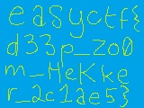

Zooooooom
======
* **85 points**
* **Category: Forensics**
* **Problem statement:** _[Hekkerman](hekkerman.jpg) is looking awfully spooky. That hekker glare could pierce a firewall. What can he see that you can't?_
* **Hint:** _Sometimes there's more than meets the eye._

Hekkerman is a picture!


If we open the picture up in a hex editor, and search for the JPG footer magic bytes "FF D9", we see that there are actually three FF D9's!
This makes me suspicious that this may be a file carving problem. Using scalpel, with PNG and JPG's enabled,
``` bash
scalpel -c scalpelConfig.txt hekkerman.jpg -o output
```

This carves out 3 JPG's. The first two JPG's are broken, and the third one is:



Theres our flag!
