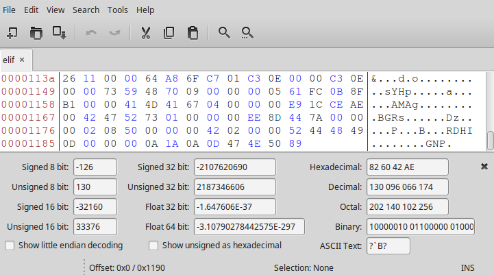
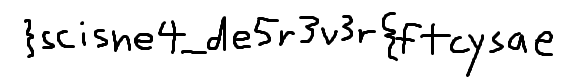

Scisnerof
======
* **75 points**
* **Category: Forensics**
* **Problem statement:** _I found weird file! [elif](elif)_
* **Hint:** _Did I put this in the wrong category?_

Scisnerof is Forensics backwards, and elif is file backwards! I bet elif is a reversed file, or is somehow reversed.
elif has no default app, so let us look at it through a hex editor. I used Bless, a linux hex editor.


If we scroll to the bottom, we see that theres the PNG File header reversed to GNP!

So it looks we just need to reverse the file!
We can do it in one line with python
``` python
$ python3
open('scisnerof.png','bw+').write(open('elif','br').read()[::-1])
```

Then open up [scisnerof.png](scisnerof.png),

and theres our flag! `easyctf{r3v3r5ed_4ensics}`
